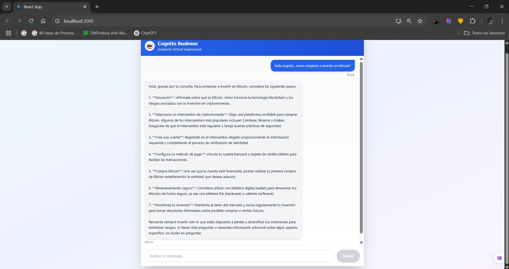

# 🤖 Cognito Business

**Asistente Virtual Empresarial Inteligente con IA Generativa**

> Chatbot profesional impulsado por GPT-4 diseñado para empresas que buscan automatizar y mejorar la atención al cliente, soporte interno y asesoramiento empresarial.

---

## 🎯 Características Principales

- ✅ **Interfaz Moderna y Responsiva** - Diseño profesional con React y Tailwind CSS
- ✅ **Backend Robusto** - Servidor Node.js + Express con arquitectura modular
- ✅ **IA Generativa Avanzada** - Integración completa con OpenAI GPT-4
- ✅ **Conversaciones Contextuales** - Historial de mensajes inteligente
- ✅ **Animaciones Fluidas** - Experiencia de usuario optimizada
- ✅ **Manejo de Errores Completo** - Estados de carga y notificaciones
- ✅ **Escalable y Mantenible** - Arquitectura preparada para crecimiento
- ✅ **CORS Configurado** - Comunicación segura frontend-backend

---

## 📊 Vista Previa

### Chat en Acción

---

## 🛠️ Stack Tecnológico

### Frontend
| Tecnología | Versión | Propósito |
|---|---|---|
| React | 18 | Interfaz de usuario |
| Tailwind CSS | 3.4 | Estilos y diseño responsivo |
| Axios | Latest | Cliente HTTP |
| CSS Animations | Native | Efectos visuales |

### Backend
| Tecnología | Versión | Propósito |
|---|---|---|
| Node.js | 18+ | Entorno de ejecución |
| Express | 5 | Framework web |
| OpenAI API | Latest | Inteligencia artificial |
| CORS | 2.8 | Compartir recursos |
| Dotenv | 17.2 | Variables de entorno |

---

## 🚀 Inicio Rápido

### Requisitos Previos
- Node.js v18 o superior
- npm v9 o superior
- Cuenta de OpenAI con API Key
- Git

### 1. Clonar el Repositorio
git clone https://github.com/TuUsuario/Cognito-Business.git
cd Cognito-Busines

text

### 2. Configurar Backend
cd backend
text

Crear archivo `.env`:
OPENAI_API_KEY=sk-proj-xxxxxxxxxxxxxxxx
PORT=3001
http://localhost:3000

text

### 3. Configurar Frontend
cd ../frontend
npm ins

text

Crear archivo `.env`:
REACT_APP_API_URL=http://localhost:3001/api

text

### 4. Ejecutar el Proyecto

**Terminal 1 - Backend:**
cd backend
http://localhost:3001
text

**Terminal 2 - Frontend:**
cd frontend
npm st

http://localhost:3000
text

---

## 📁 Estructura del Proyecto

Cognito-Business/
├── backend/
│ ├── src/
│ │ ├── config/
│ │ │ └── openai.js # Configuración de OpenAI
│ │ ├── controllers/
│ │ │ └── chatController.js # Lógica del chat
│ │ ├── routes/
│ │ │ └── chatRoutes.js # Rutas de la API
│ │ └── middleware/
│ │ └── errorHandler.js # Manejo de errores
│ ├── .env # Variables de entorno
│ ├── server.js # Punto de entrada
│ ├── package.json
│ └── README.md
│
├── frontend/
│ ├── src/
│ │ ├── components/
│ │ │ └── Chat/
│ │ │ ├── ChatWindow.jsx # Componente principal
│ │ │ ├── ChatHeader.jsx # Encabezado
│ │ │ ├── Message.jsx # Mensaje individual
│ │ │ ├── MessageInput.jsx # Input de mensajes
│ │ │ └── TypingIndicator.jsx # Indicador de escritura
│ │ ├── services/
│ │ │ └── chatService.js # Llamadas a la API
│ │ ├── utils/
│ │ │ └── formatDate.js # Utilidades
│ │ ├── styles/
│ │ │ └── animations.css # Animaciones
│ │ └── App.js
│ ├── .env
│ ├── package.json
│ └── README.md
│
├── assets/
│ └── screenshots/ # Capturas de pantalla
│
├── .gitignore
├── README.md # Este archivo
text

---

## 🔑 Variables de Entorno

### Backend (.env)
API de OpenAI
OPENAI_API_KEY=tu_clave_api_aqui

Puerto del servidor
PORT=3001

CORS permitidos
ALLOWED_ORIGINS=http://localhost:3000,https://tudominio.com

text

### Frontend (.env)
URL de la API del backend
REACT_APP_API_URL=http://localhost:3001/api

text

---

## 📚 Documentación Detallada

- [Backend README](./backend/README.md) - Documentación del servidor
- [Frontend README](./frontend/README.md) - Documentación de la interfaz

---

## 🔐 Seguridad

- ✅ Variables de entorno protegidas
- ✅ CORS configurado correctamente
- ✅ Validación de entradas en backend
- ✅ Manejo robusto de errores
- ✅ API Key nunca expuesta en frontend

---

## 🎯 Funcionalidades Futuras

- [ ] Sistema de autenticación de usuarios
- [ ] Múltiples asistentes especializados
- [ ] Exportación de conversaciones (PDF/JSON)
- [ ] Integración con base de datos
- [ ] Dashboard de analíticas
- [ ] Soporte para múltiples idiomas
- [ ] API Webhooks
- [ ] Sistema de rating de respuestas

---

## 🤝 Contribuir

Las contribuciones son bienvenidas. Por favor:

1. Fork el proyecto
2. Crea una rama para tu característica (`git checkout -b feature/AmazingFeature`)
3. Commit tus cambios (`git commit -m 'Add some AmazingFeature'`)
4. Push a la rama (`git push origin feature/AmazingFeature`)
5. Abre un Pull Request

---

## 📞 Soporte

- 📧 Email: devjhonharvey@gmail.com
- 💬 Issues: [GitHub Issues](https://github.com/TuUsuario/Cognito-Business/issues)

---

## 👨‍💻 Autor

**Tu Nombre**
- GitHub: JhonHTipas21
- LinkedIn: https://www.linkedin.com/in/jhon-harvey-tipas-solis-b45135259/
- Portfolio: https://dev-jhon-portafolio.vercel.app/

---

## 📄 Licencia

Este proyecto está bajo la Licencia MIT - ver el archivo [LICENSE](LICENSE) para más detalles.

---

## ⭐ Reconocimientos

- OpenAI por la increíble API de GPT-4
- Comunidad de React y Node.js
- Tailwind CSS por el framework CSS

---
